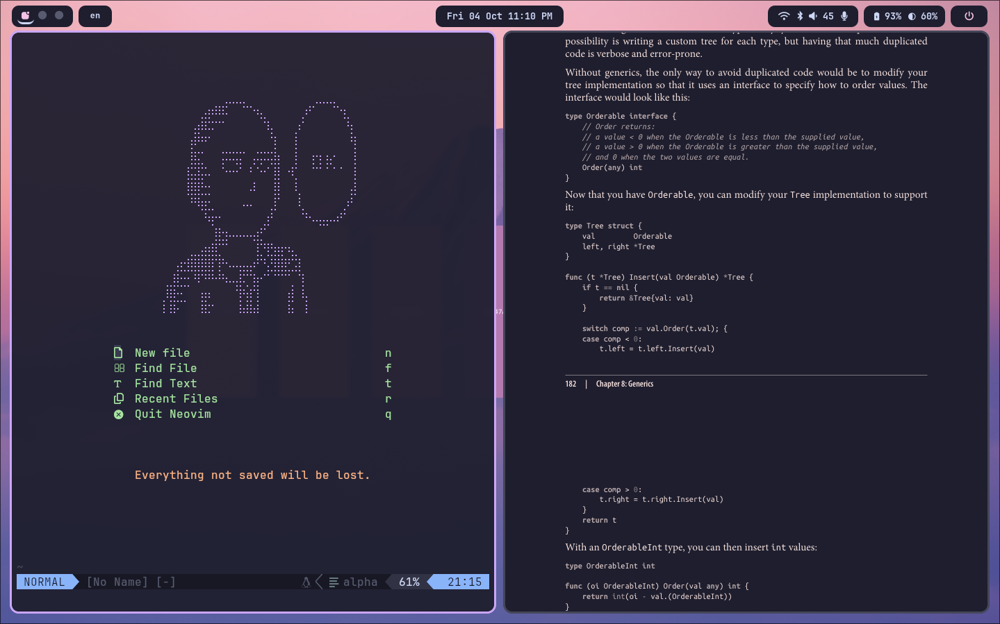
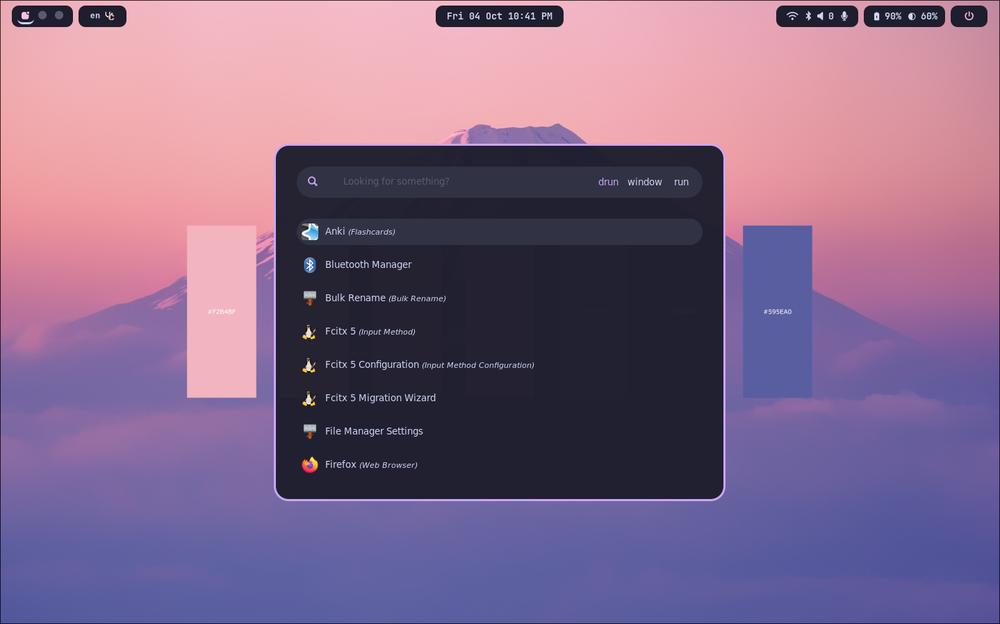

<h1 align="center">
    
   <br>
      Walnut Environment
   <br>
       <br>
   <div align="center">

   <div align="center">
      <p></p>
      <div align="center">
         <a href="https://github.com/zenoix/walnut-environment/">
            
         </a>
         <a = href="https://nixos.org">
            
         </a>
         <a href="https://github.com/zenoix/walnut-environment/blob/main/LICENSE">
            
         </a>
      </div>
      <br>
   </div>
</h1>

## Screenshots

As at 04/10/2024







## Environment


| Type           | Program      |
| :------------- | :----------: |
| Browser         | Firefox |
| Cursor     | Catppuccin Cursor |
| Display Manager     | Sddm |
| Editor         | Neovim |
| Fetch         | Fastfetch |
| File Manager   | Thunar |
| Launcher       | Rofi |
| Lockscreen       | Hypridle + Hyprlock |
| Media Player     | Not yet configured |
| Notification Daemon       | Dunst |
| Screenshot Software    | Grim + Slurp + Swappy |
| Shell          | Zsh |
| Status Bar     | Waybar |
| Terminal       | Ghostty |
| Terminal Font  | Monaspace Neon |
| Theme         | Catppuccin Mocha |
| Window Manager | Hyprland |

## Layout

```
walnut-environment
├── assets                  # Assets used in configurations
├── homeManagerModules      # Home manager modules
│   ├── ...
│   └── README.md           # Readme explaining home manager modules layout
├── hosts                   # Different hosts and their configurations
│   ├── walnut-nixos
│   └── wsl
├── modules                 # System modules
│   ├── ...
│   └── README.md           # Readme explaining modules layout
├── overlays                # Overlays
├── flake.nix               # Flake (main entry point)
└── flake.lock              # Flake lock file
```

## Setup

First clone and place the directory in the right place
```sh
git clone https://github.com/zenoix/walnut-environment
mv walnut-environment $HOME # Config should be placed in ~/
cd $HOME/walnut-environment
```

You'll want to then edit `flake.nix`'s  `personal` attribute set to your own information so that it has your username, hostname, timezone, local, city, and git information. For example:

```nix
let
  system = "x86_64-linux";

  personal = {
    user = "bob";
    host = "mycomputer";
    timeZone = "America/New_York";
    defaultLocale = "en_US.UTF-8";
    city = "New York";

    # Used for gitconfig
    gitUser = "gituser1234";
    gitEmail = "gituser1234@gmail.com";
  };

  ...
in
{
  ...
```

The remaining steps depend on if you are using NixOS, WSL, or both. At the end of the setup section, there are instructions for creating and adding more hosts.

### NixOS Setup

If you're using NixOS, you'll want to replace the hardware configuration file in the `hosts/walnut-nixos` directory:

```sh
rm hosts/walnut-nixos/hardware-configuration.nix
cp /etc/nixos/hardware-configuration.nix hosts/wanut-nixos/hardware-configuration.nix
```

Lastly, to rebuild the system, use 
```sh
sudo nixos-rebuild switch --flake ~/walnut-environment
```
and/or for home manager
```sh
home-manager switch --flake ~/walnut-environment
```

> [!TIP]
> You may need to add the following to your current NixOS configuration (`/etc/nixos/configuration.nix`) if you haven't enabled flakes before:
> ```nix
> nix.settings.experimental-features = [
>  "nix-command"
>  "flakes"
> ];
> and rebuild your system to enable flakes.

These two switch commands are aliased in my home manager configuration to `rb` and `hms` respectively which makes future rebuilding easier. 

### WSL Setup

First, start with installing Nix (the package manager) onto your WSL distribution by following the instructions on the [NixOS website](https://nixos.org/download/#nix-install-windows).

> [!TIP]
> In my experience, Nix and home manager only work when **multi-user** installation is used.

Then follow the [home manager installation instructions](https://nix-community.github.io/home-manager/index.xhtml#sec-install-standalone) for standalone installation.

> [!IMPORTANT]
> Do not close or restart your terminal as home manager will not be permanently installed yet at this point.

Next, in `flake.nix`, you'll want to change the `wsl.user` value to whatever your WSL username is. Make sure to also edit the `personal` attribute set to your own information (if you haven't already). For example:

```nix
let
  system = "x86_64-linux";

  personal = {
    user = "i_am_a_wsl_user"; # This isn't used by WSL-only config
    host = "mywsl"; # This isn't used by WSL-only config
    timeZone = "America/New_York";
    defaultLocale = "en_US.UTF-8";
    city = "New York";

    # Used for gitconfig
    gitUser = "gituser1234";
    gitEmail = "gituser1234@gmail.com";
  };

  wsl = {
    user = "i_am_a_wsl_user";
  };
in
{
  ...
```

Lastly, run the following command to get everything set up (including permanently having home manager installed):
```sh
home-manager --extra-experimental-features "nix-command flakes" switch --flake ~/walnut-environment
```

This command is aliased in my home manager configuration to `hms` which makes future rebuilding easier. 

### Setting Up New Hosts

TODO

## Configuration

TODO

## Credits:

Wallpapers are from reddit:
- [u/Ezellix's Mount Fuji, pink palette [5120x2880]](https://www.reddit.com/r/wallpaper/comments/p4zvb7/mount_fuji_pink_palette_5120x2880/)
- [u/marinemotion's Mount Fuji color palette [3840X2160]](https://www.reddit.com/r/wallpaper/comments/q5qc1v/mount_fuji_color_palette_3840x2160/)

Firefox CSS was modified from [mimipile's firefoxCSS repo](https://github.com/mimipile/firefoxCSS)

README header was modified from [Frost Pheonix's catppuccin config](https://github.com/Frost-Phoenix/nixos-config/blob/catppuccin/README.md)

Rofi was modified from [Sukhmancs' nixos config](https://github.com/sukhmancs/nixos-configs)

Fastfetch was modified from [LierB's fastfetch presets](https://github.com/LierB/fastfetch)

Some waybar components were taken from [Spelljinxer's dotfiles](https://github.com/Spelljinxer/dotfiles)
